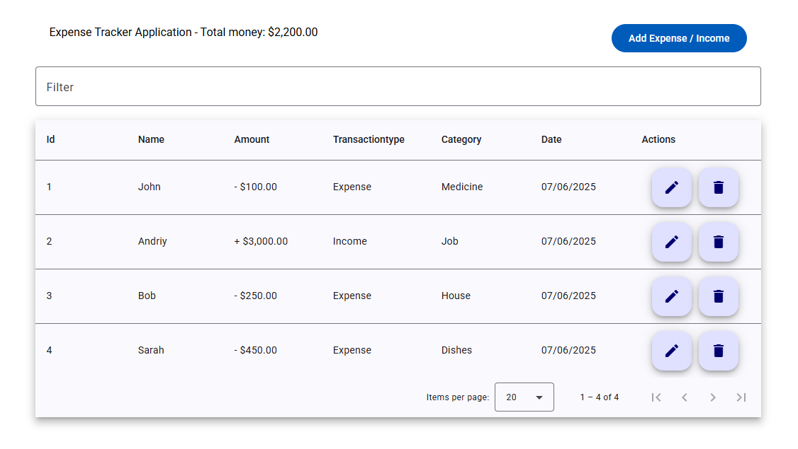

# Welcome to Expense Tracker App



## Description

Expense Tracker Application is a web application designed to help users track their personal finances. It allows users
to add and categorize income and expense records, view the total balance (income minus expenses), and filter
transactions by type and category. Users can also sort transactions by date or amount, making it easy to manage their
financial records.

- **View a paginated table** of transactions (expenses and income), including:

  - ID
  - Name
  - Amount (negative for expenses, positive for income)
  - Type (“Expense” or “Income”)
  - Category (e.g. Medicine, Job, House, Dishes)
  - Date

- **Filter** transactions by typing into the search box at the top.
- **Add** new entries via a modal form (Name, Amount, Type, Category, Date).
- **Edit** existing entries inline by clicking the pencil icon.
- **Delete** entries with the trash icon.
- **See your current balance** displayed prominently in the header.

## 🚀 Features

- **CRUD Operations**: Create, Read, Update, Delete transactions in a single-page interface.
- **Dynamic Filtering**: Search box filters the table in real time.
- **Pagination**: Control how many items appear per page; navigate between pages.
- **Modal Form**: “Add Expense / Income” opens a clean, accessible dialog for data entry.
- **Responsive UI**: Works on desktop and tablet screens; adapts to different widths.

## 🛠 Tech Stack

- **Framework:** Angular
- **UI Library:** Angular Material
- **State Management:** RxJS
- **Forms & Validation:** Reactive Forms
- **Styling:** SCSS
- **Build Tools:** Angular CLI

## 💻 Getting Started

```bash
git clone https://github.com/AndrewT9/Expense-Tracker-Application.git
```

```bash
npm install
```

```bash
ng serve
```
